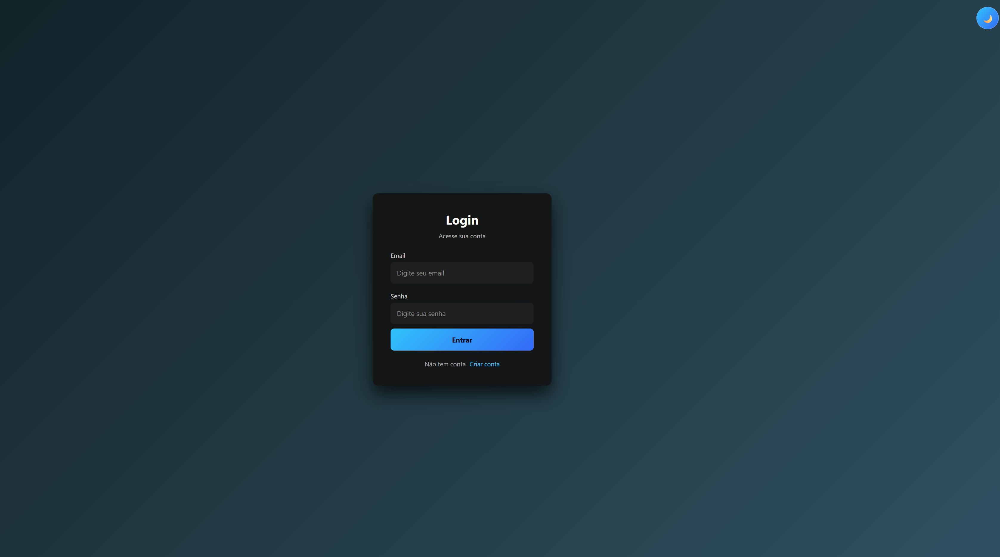
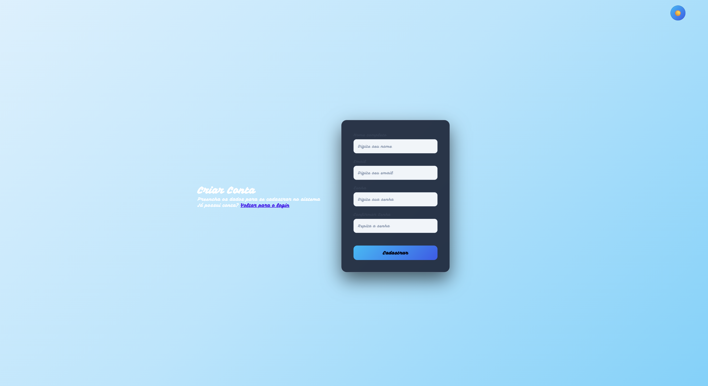
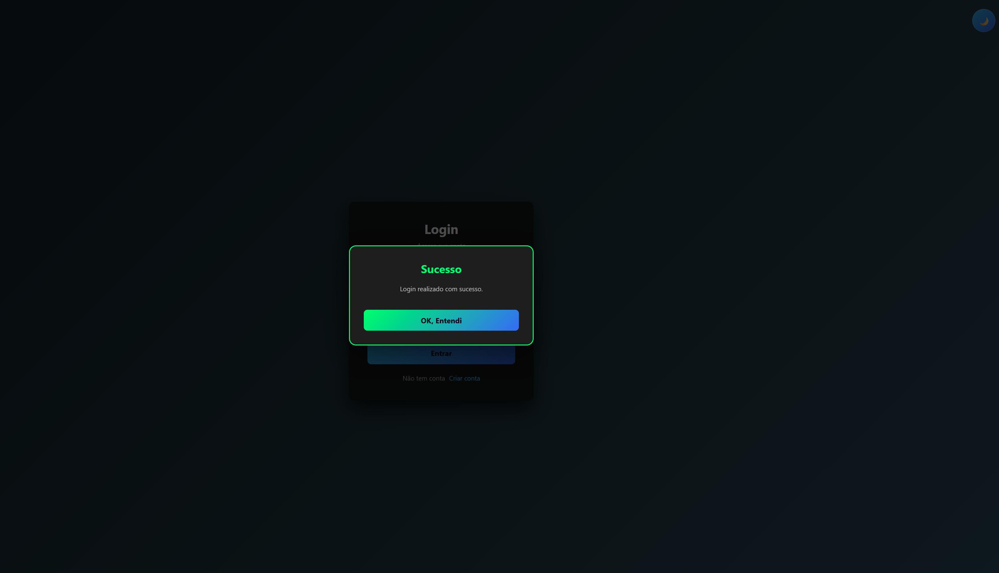
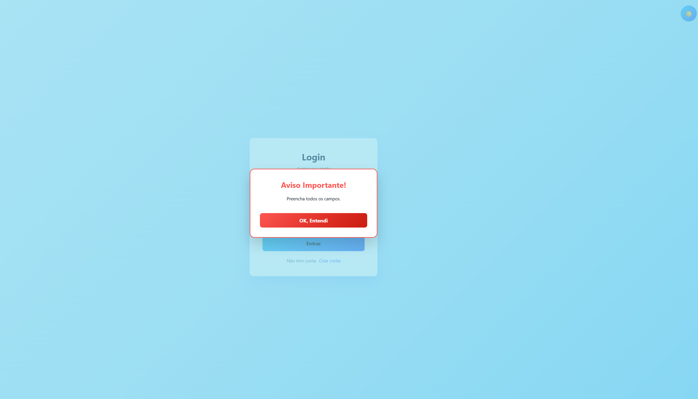
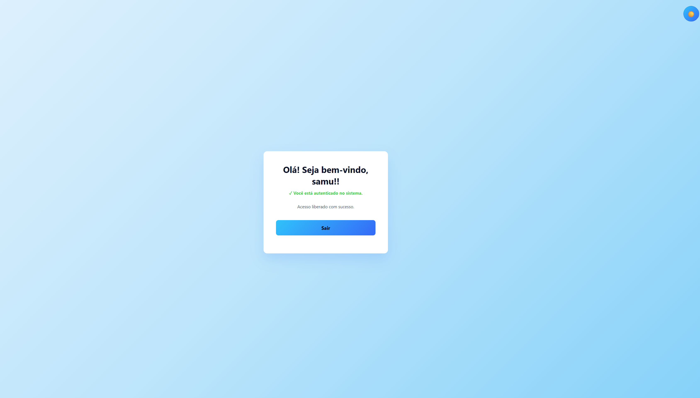

# Login System

## Sobre o projeto

O **Login System** é uma aplicação web desenvolvida como Atividade Final da disciplina de Projeto Prático Web Front End / Desenvolvimento Web, do Curso Técnico em Ciências de Dados da Escola do Futuro. O projeto demonstra um sistema completo de **cadastro e autenticação de usuários**, integrando desenvolvimento Front-End e Back-End, com validação de formulários, criptografia de senhas, autenticação via JWT e sistema de notificações por modal.

---

## Funcionalidades

- [x] Cadastro de usuários
- [x] Login
- [x] Validação de formulários (Front-End e Back-End)
- [x] Criptografia de senhas com bcrypt
- [x] Autenticação utilizando JWT (JSON Web Token)
- [x] Alternância entre tema claro (Light) e tema escuro (Dark)
- [x] Sistema de notificações utilizando modal (substituindo `alert()`)
- [x] Página protegida (Home), acessível somente após login
- [x] API REST desenvolvida com Node.js e Express
- [x] Tratamento de erros (campos vazios, e-mail duplicado, senha incorreta, servidor indisponível)

---


## Tecnologias utilizadas

### Front-End


### Back-End


---

## Estrutura do projeto

```text
Projeto_Login_System/
├── backend/
│   ├── database/
│   │   └── users.json
│   ├── routes/
│   │   └── auth.js
│   └── server.js
├── frontend/
│   ├── css/
│   │   ├── styleDark.css
│   │   └── style_register.css
│   ├── js/
│   │   ├── home.js
│   │   ├── login.js
│   │   ├── modal.js
│   │   ├── register.js
│   │   └── theme.js
│   ├── home.html
│   ├── index.html
│   └── register.html
├── .gitignore
├── Atividade de Fixação.txt
├── package.json
└── README.md
```


Cada arquivo JavaScript possui uma responsabilidade clara:

| Arquivo | Responsabilidade |
|---|---|
| `login.js` | Comportamento da tela de login |
| `register.js` | Comportamento da tela de cadastro |
| `theme.js` | Controle de alternância do tema (claro/escuro) |
| `modal.js` | Sistema de notificações (modal) |
| `auth.js` | Autenticação e rotas no Back-End |

---

## Como executar

### 1. Clonar o repositório

```bash
git clone https://github.com/samuel-jesus-oliveira/Projeto_Login_System.git
```

### 2. Entrar na pasta do projeto

```bash
cd Projeto_Login_System
```

### 3. Instalar as dependências

```bash
npm install
```

### 4. Iniciar o servidor

```bash
npm start
```

### 5. Acessar o Front-End

Abra o arquivo `frontend/index.html` no navegador.

---

## Variáveis de ambiente

O projeto utiliza variáveis de ambiente para configurações sensíveis. Crie um arquivo `.env` dentro da pasta `backend/`:

```
PORT=3000
JWT_SECRET=sua_chave_secreta
```


---

## Como utilizar o sistema

1. Acesse a página de cadastro (`register.html`).
2. Crie um usuário informando nome, e-mail, senha e confirmação de senha.
3. Após o cadastro, retorne para a página de login.
4. Informe e-mail e senha cadastrados.
5. Realize o login.
6. Após a autenticação, você será redirecionado para a página `home.html`.
7. Utilize o botão de alternância de tema para trocar entre o modo claro e o modo escuro.

---

## Fluxo de autenticação (JWT)

```
Usuário
   ↓
Login
   ↓
Backend
   ↓
Validação
   ↓
JWT
   ↓
Frontend
```

O token JWT é gerado pelo Back-End após a validação do login e armazenado pelo `login.js` no Front-End, sendo utilizado para controlar o acesso à página protegida.

---

## Tela de Login (Dark)



 ## Tela de Cadastro (Light) 



## Modal de sucesso (Dark)



## Modal erro (Light)



## Pagina Home



---

## 👤 Autor

<div align="center">

### **Samuel Jesus Oliveira**

[](https://github.com/samuel-jesus-oliveira)
[](https://linkedin.com)

🎓 **Estudante de Ciência de Dados e Análise**  
🏫 **Escola do Futuro Paulo Renato de Souza**  
👨‍🏫 **Orientador:** Prof. Heraclides Mourão

---

> *Projeto desenvolvido para a avaliação final do módulo de Desenvolvimento Web / Front-End & Back-End.*

</div>